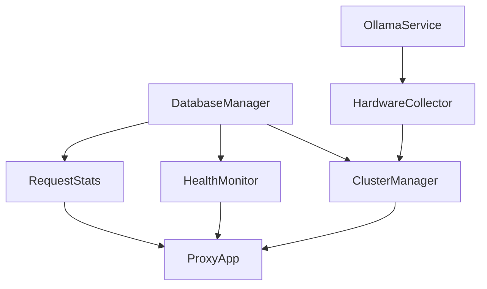

# Roadmap d'implémentation de la persistance avec TinyDB

## Introduction

Ce document présente la roadmap détaillée pour l'implémentation d'un système de persistance de données basé sur TinyDB dans le projet OLOL. Il décrit les étapes, les dépendances entre les composants et les objectifs à atteindre à chaque phase du développement.

**Objectifs principaux :**
- Remplacer les structures en mémoire (verrous, dictionnaires) par une persistance basée sur TinyDB
- Collecter des informations détaillées sur les ressources matérielles des nœuds
- Mettre en place un mécanisme robuste de synchronisation des données
- Assurer une abstraction permettant une migration future vers d'autres systèmes de stockage

## Phase 1 : Mise en place de l'infrastructure de persistance

### 1.1 Classe d'abstraction DatabaseManager (✓ Complété)

**Fichier :** `/src/osync/proxy/db/database.py`

La classe d'abstraction [`DatabaseManager`](/src/osync/proxy/db/database.py) a été implémentée avec les fonctionnalités suivantes :
- Interface CRUD complète (Create, Read, Update, Delete)
- Singleton pour accès global à l'instance
- Gestion des chemins de stockage automatisée
- Horodatage automatique des documents
- Support de requêtes flexibles

**Relations :**
- Utilisé par tous les autres composants nécessitant une persistance
- Point d'accès unique via la fonction `get_db()`

### 1.2 Ajout de la dépendance à TinyDB (✓ Complété)

**Fichier :** `/pyproject.toml`

La dépendance à TinyDB a été ajoutée au fichier pyproject.toml :
```toml
dependencies = [
    # ...autres dépendances existantes...
    "tinydb>=4.8.0",
]
```

### 1.3 Schéma des données

Définition du schéma des tables pour la persistance des données :

#### Table `servers`
```json
{
  "address": "host:port",
  "healthy": true,
  "load": 0.45,
  "last_check": "2025-04-30T14:30:00",
  "first_seen": "2025-04-28T10:15:20",
  "hardware_info": {
    "cpu": { ... },
    "ram": { ... },
    "gpu": { ... },
    "storage": { ... }
  }
}
```

#### Table `models`
```json
{
  "name": "llama3",
  "servers": ["host1:port", "host2:port"],
  "size_gb": 8,
  "parameter_count": "8B",
  "quantization": "Q4_K_M",
  "first_seen": "2025-04-15T08:20:00",
  "last_used": "2025-04-30T14:30:00",
  "usage_count": 157
}
```

#### Table `server_stats`
```json
{
  "server": "host:port",
  "timestamp": "2025-04-30T14:30:00",
  "type": "health|load|latency",
  "value": 0.75
}
```

#### Table `request_stats`
```json
{
  "timestamp": "2025-04-30T14:30:00",
  "period": "hourly|daily|weekly",
  "total_requests": 1458,
  "generate_requests": 857,
  "chat_requests": 523,
  "embedding_requests": 78,
  "average_latency_ms": 235.5
}
```

#### Table `config`
```json
{
  "key": "proxy_settings|load_balancing|retry_policy",
  "value": {},
  "updated_at": "2025-04-30T14:30:00"
}
```

## Phase 2 : Intégration au gestionnaire de cluster

### 2.1 Modification du ClusterManager

**Fichier :** `/src/osync/proxy/cluster/manager.py`

**Tâches :**
- [ ] Modifier la méthode `refresh_cache` pour synchroniser avec TinyDB
- [ ] Modifier `initialize` pour charger les données depuis TinyDB
- [ ] Ajouter des méthodes dédiées pour la persistance des serveurs et modèles

**Méthodes à modifier :**
```python
def refresh_cache(self):
    """
    Met à jour le cache des informations du cluster et persiste dans TinyDB.
    """
    # 1. Obtenir les données du cluster (code existant)
    # 2. Synchroniser avec TinyDB
    # 3. Mettre à jour le cache local
    
def initialize(self, cluster_config=None):
    """
    Initialise ou réinitialise le cluster et charge les données depuis TinyDB.
    """
    # 1. Initialiser le cluster (code existant)
    # 2. Charger les données de TinyDB
    # 3. Réconcilier avec l'état actuel
```

**Nouvelles méthodes à ajouter :**
```python
def persist_server(self, server_address, health=None, load=None):
    """
    Persiste les informations d'un serveur dans TinyDB.
    """
    
def persist_model_map(self, model_name, servers):
    """
    Persiste la mapping modèle-serveurs dans TinyDB.
    """
```

**Relations :**
- Utilise `database.get_db()` pour accéder à TinyDB
- Appelé par `proxy.app` au démarrage

### 2.2 Initialisation au démarrage

**Fichier :** `/src/osync/proxy/app.py`

**Tâches :**
- [ ] Modifier l'initialisation pour charger l'état depuis TinyDB
- [ ] Ajouter une logique de réconciliation entre l'état persisté et l'état actuel
- [ ] Gérer la persistance des nouvelles données au démarrage

## Phase 3 : Intégration au moniteur de santé

### 3.1 Modification du HealthMonitor

**Fichier :** `/src/osync/proxy/cluster/health.py`

**Tâches :**
- [ ] Stocker l'historique de santé dans TinyDB
- [ ] Modifier `check_all_servers_health` pour persister les données
- [ ] Modifier `get_health_report` pour utiliser TinyDB

**Méthodes à modifier :**
```python
def check_all_servers_health(self):
    """
    Vérifie la santé de tous les serveurs et persiste les données.
    """
    # 1. Vérifier la santé (code existant)
    # 2. Persister dans TinyDB
    # 3. Mettre à jour l'historique en mémoire (optionnel)
    
def get_health_report(self):
    """
    Génère un rapport de santé complet en utilisant les données de TinyDB.
    """
    # 1. Requêter TinyDB pour les données récentes
    # 2. Générer le rapport
```

**Nouvelles méthodes à ajouter :**
```python
def cleanup_old_stats(self, days_to_keep=30):
    """
    Nettoie les anciennes statistiques au-delà de la période spécifiée.
    """
```

### 3.2 Extraction de l'historique de santé

**Tâches :**
- [ ] Créer des méthodes pour extraire des statistiques historiques
- [ ] Implémenter l'agrégation des données pour différentes périodes
- [ ] Fournir des méthodes d'accès pour l'API et l'interface web

## Phase 4 : Intégration aux statistiques de requêtes

### 4.1 Modification du module de statistiques

**Fichier :** `/src/osync/proxy/stats.py`

**Tâches :**
- [ ] Persister les statistiques dans TinyDB
- [ ] Implémenter un mécanisme d'agrégation périodique
- [ ] Ajouter des fonctions pour interroger les statistiques historiques

**Méthodes à modifier :**
```python
def update_request_stats(request_type: str, increment: bool = True):
    """
    Met à jour les statistiques et les persiste dans TinyDB.
    """
    
def get_stats_snapshot():
    """
    Récupère une image des statistiques depuis TinyDB.
    """
```

**Nouvelles méthodes à ajouter :**
```python
def aggregate_stats(period="hourly"):
    """
    Agrège les statistiques pour la période spécifiée.
    """
    
def get_historical_stats(period="daily", days=7):
    """
    Récupère les statistiques historiques pour la période spécifiée.
    """
```

## Phase 5 : Collecte d'informations matérielles des nœuds

### 5.1 Extension du service Ollama

**Fichier :** `/src/osync/service.py`

**Tâches :**
- [ ] Ajouter une nouvelle méthode RPC `GetSystemInfo`
- [ ] Implémenter la collecte d'informations système (CPU, RAM, GPU, stockage)
- [ ] Intégrer avec le framework gRPC

**Nouvelles méthodes à ajouter :**
```python
def GetSystemInfo(self, request, context):
    """
    Collecte et retourne les informations système détaillées du nœud.
    """
```

### 5.2 Mise à jour du fichier Proto

**Fichier :** `/src/osync/proto/ollama.proto`

**Tâches :**
- [ ] Définir les messages `SystemInfoRequest` et `SystemInfoResponse`
- [ ] Ajouter la méthode RPC au service

**Exemple de définition :**
```protobuf
message SystemInfoRequest {
  bool include_hardware_details = 1;
}

message SystemInfoResponse {
  string system = 1;  // JSON avec les informations système
  string cpu = 2;     // JSON avec les informations CPU
  string memory = 3;  // JSON avec les informations de mémoire
  string disk = 4;    // JSON avec les informations de disque
  string gpu = 5;     // JSON avec les informations GPU
}

service OllamaService {
  // Autres méthodes RPC existantes
  
  // Récupère les informations système détaillées
  rpc GetSystemInfo(SystemInfoRequest) returns (SystemInfoResponse);
}
```

### 5.3 Intégration au ClusterManager

**Fichier :** `/src/osync/proxy/cluster/manager.py`

**Tâches :**
- [ ] Ajouter une méthode pour récupérer les informations système des nœuds
- [ ] Planifier des collectes périodiques d'informations
- [ ] Persister les informations dans TinyDB

## Phase 6 : API et interface utilisateur

### 6.1 Extension de l'API

**Fichier :** `/src/osync/proxy/api/routes.py`

**Tâches :**
- [ ] Ajouter des endpoints pour accéder aux données persistées
- [ ] Fournir des méthodes d'agrégation et de filtrage
- [ ] Documenter l'API avec Swagger

**Endpoints à ajouter :**
```
GET /api/v1/servers/history?server={server}&metric={metric}&period={period}
GET /api/v1/stats/requests?period={period}&type={type}
GET /api/v1/nodes/hardware?server={server}
```

### 6.2 Mise à jour de l'interface web

**Fichiers :** Divers templates dans `/src/osync/proxy/web/templates/`

**Tâches :**
- [ ] Ajouter des visualisations pour les données historiques
- [ ] Créer une page dédiée aux métriques matérielles
- [ ] Améliorer la page de santé avec des graphiques basés sur les données persistées

## Phase 7 : Tests et optimisation

### 7.1 Tests unitaires et d'intégration

**Tâches :**
- [ ] Écrire des tests unitaires pour `DatabaseManager`
- [ ] Tester la récupération après redémarrage
- [ ] Tester les performances avec différentes charges de données

### 7.2 Optimisation des performances

**Tâches :**
- [ ] Mettre en place des index dans TinyDB
- [ ] Optimiser les requêtes fréquentes
- [ ] Implémenter un mécanisme de mise en cache pour réduire les accès à la base de données

### 7.3 Documentation

**Tâches :**
- [ ] Documenter l'architecture de persistance
- [ ] Fournir des exemples d'utilisation
- [ ] Mettre à jour le README avec les nouvelles fonctionnalités

## Suivi du progrès

| Phase | Tâche | Statut | Date | Notes |
|-------|-------|--------|------|-------|
| 1.1 | Classe d'abstraction DatabaseManager | ✅ | 2025-04-30 | Implémentation initiale complète |
| 1.2 | Ajout de la dépendance à TinyDB | ✅ | 2025-04-30 | Ajouté à pyproject.toml |
| 1.3 | Schéma des données | ⏳ | - | En cours de finalisation |
| 2.1 | Modification du ClusterManager | 🔄 | - | À commencer |
| ... | ... | ... | ... | ... |

## Structure des dépendances entre composants



## Migration future vers d'autres systèmes de base de données

L'architecture a été conçue pour faciliter une migration future vers d'autres systèmes de base de données plus robustes. Voici les étapes clés pour une telle migration :

1. Créer une nouvelle implémentation de `DatabaseManager` pour le nouveau système
2. Migrer les données depuis TinyDB
3. Remplacer les instances `get_db()` par la nouvelle implémentation

Les systèmes potentiels pour une migration future incluent :
- SQLite pour une persistance locale plus robuste
- PostgreSQL pour un déploiement en production à grande échelle
- MongoDB pour une architecture distribuée

## Conclusion

Cette roadmap fournit un plan détaillé pour l'implémentation progressive de la persistance des données avec TinyDB dans le projet OLOL. En suivant cette approche modulaire, nous pouvons assurer que chaque composant est correctement intégré et testé tout en maintenant la cohérence globale du système.

La conception orientée abstraction nous permet également de faciliter une migration future vers d'autres systèmes de base de données si nécessaire, tout en maintenant une interface cohérente pour les développeurs travaillant sur le projet.