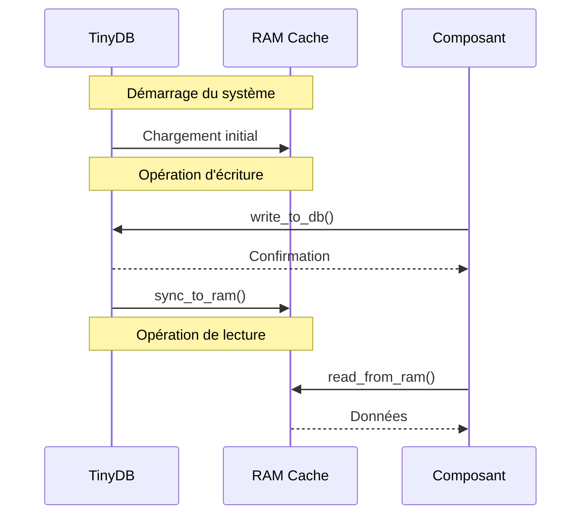
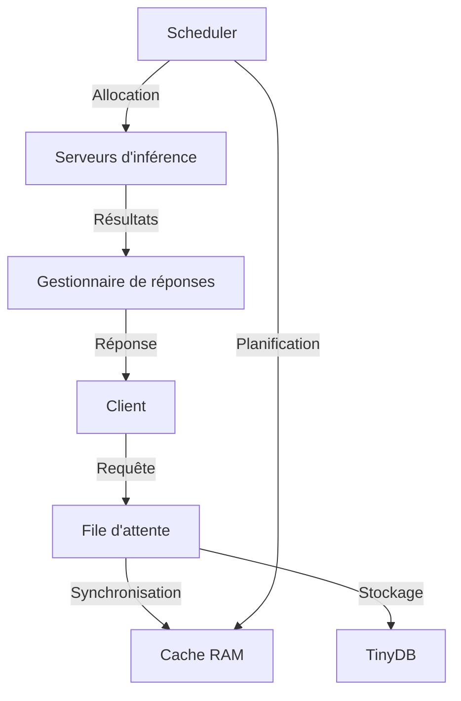
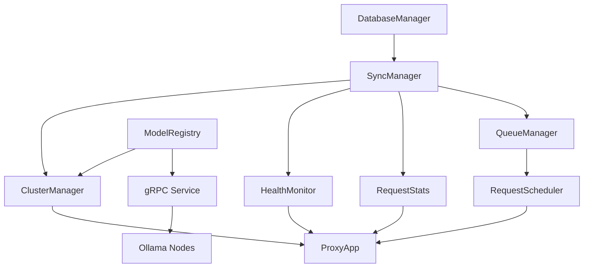

# Roadmap d'implémentation de la persistance avec TinyDB

## Introduction

Ce document présente la roadmap détaillée pour l'implémentation d'un système de persistance de données basé sur TinyDB dans le projet OLOL. Il décrit les étapes, les dépendances entre les composants et les objectifs à atteindre à chaque phase du développement.

**Objectifs principaux :**
- Remplacer les structures en mémoire (verrous, dictionnaires) par une persistance basée sur TinyDB
- Collecter des informations détaillées sur les ressources matérielles des nœuds
- Mettre en place un mécanisme robuste de synchronisation des données entre TinyDB et la RAM
- Assurer une abstraction permettant une migration future vers d'autres systèmes de stockage
- Implémenter un système de registre des modèles pour la gestion centralisée
- Développer un mécanisme de file d'attente pour optimiser les inférences et gérer la charge

## Phase 1 : Mise en place de l'infrastructure de persistance

### 1.1 Classe d'abstraction DatabaseManager (✓ Complété)

**Fichier :** `/src/osync/proxy/db/database.py`

La classe d'abstraction [`DatabaseManager`](/src/osync/proxy/db/database.py) a été implémentée avec les fonctionnalités suivantes :
- Interface CRUD complète (Create, Read, Update, Delete)
- Singleton pour accès global à l'instance
- Gestion des chemins de stockage automatisée
- Horodatage automatique des documents
- Support de requêtes flexibles

**Relations :**
- Utilisé par tous les autres composants nécessitant une persistance
- Point d'accès unique via la fonction `get_db()`

### 1.2 Ajout de la dépendance à TinyDB (✓ Complété)

**Fichier :** `/pyproject.toml`

La dépendance à TinyDB a été ajoutée au fichier pyproject.toml :
```toml
dependencies = [
    # ...autres dépendances existantes...
    "tinydb>=4.8.0",
]
```

### 1.3 Schéma des données

Définition du schéma des tables pour la persistance des données :

#### Table `servers`
```json
{
  "address": "host:port",
  "healthy": true,
  "load": 0.45,
  "last_check": "2025-04-30T14:30:00",
  "first_seen": "2025-04-28T10:15:20",
  "hardware_info": {
    "cpu": { ... },
    "ram": { ... },
    "gpu": { ... },
    "storage": { ... }
  }
}
```

#### Table `models`
```json
{
  "name": "llama3",
  "servers": ["host1:port", "host2:port"],
  "size_gb": 8,
  "parameter_count": "8B",
  "quantization": "Q4_K_M",
  "first_seen": "2025-04-15T08:20:00",
  "last_used": "2025-04-30T14:30:00",
  "usage_count": 157
}
```

#### Table `server_stats`
```json
{
  "server": "host:port",
  "timestamp": "2025-04-30T14:30:00",
  "type": "health|load|latency",
  "value": 0.75
}
```

#### Table `request_stats`
```json
{
  "timestamp": "2025-04-30T14:30:00",
  "period": "hourly|daily|weekly",
  "total_requests": 1458,
  "generate_requests": 857,
  "chat_requests": 523,
  "embedding_requests": 78,
  "average_latency_ms": 235.5
}
```

#### Table `config`
```json
{
  "key": "proxy_settings|load_balancing|retry_policy",
  "value": {},
  "updated_at": "2025-04-30T14:30:00"
}
```

#### Table `inference_queue`
```json
{
  "id": "request-uuid",
  "model": "llama3",
  "prompt": "Texte du prompt",
  "status": "pending|processing|completed|failed",
  "priority": 1,
  "created_at": "2025-04-30T14:30:00",
  "started_at": "2025-04-30T14:30:05",
  "completed_at": "2025-04-30T14:30:10",
  "server_assigned": "host:port",
  "batch_id": "batch-uuid"
}
```

## Phase 2 : Synchronisation DB-RAM et communication gRPC

### 2.1 Architecture de synchronisation

**Principes fondamentaux :**
- La base de données TinyDB est la source de vérité persistante
- Les structures en mémoire sont utilisées pour les accès rapides
- Toute modification est d'abord écrite en DB puis synchronisée en RAM
- Un mécanisme de chargement initial charge les données depuis TinyDB au démarrage

**Mécanisme de synchronisation :**


### 2.2 Implémentation de la synchronisation

**Fichier :** `/src/osync/proxy/db/sync_manager.py`

**Tâches :**
- [ ] Créer une classe `SyncManager` pour gérer la synchronisation
- [ ] Implémenter les méthodes de synchronisation bidirectionnelle
- [ ] Ajouter des mécanismes de verrouillage pour les accès concurrents
- [ ] Gérer les cas de conflits et de réconciliation

**Méthodes à implémenter :**
```python
class SyncManager:
    def __init__(self):
        self.db = get_db()
        self._ram_cache = {}
        self._locks = {}
    
    def load_initial_state(self):
        """Charge l'état initial depuis TinyDB vers la RAM."""
        
    def write_and_sync(self, table, data, doc_id=None):
        """Écrit dans TinyDB et synchronise avec la RAM."""
        
    def read_from_ram(self, table, query=None):
        """Lit les données depuis la RAM."""
        
    def force_sync(self, table=None):
        """Force la synchronisation entre TinyDB et la RAM."""
```

## Phase 3 : Intégration gRPC et système de registre de modèles

### 3.1 Amélioration de la communication gRPC

**Fichier :** `/src/osync/service.py`

**Tâches :**
- [ ] Étendre le service gRPC pour collecter toutes les métriques des nœuds
- [ ] Ajouter des endpoints pour accéder à toutes les fonctionnalités d'Ollama
- [ ] Implémenter des méthodes pour la gestion des modèles à distance

**Nouvelles méthodes à ajouter :**
```python
def GetCompleteNodeStatus(self, request, context):
    """
    Collecte l'état complet du nœud, incluant les métriques système.
    """

def RemoteModelCommand(self, request, context):
    """
    Exécute une commande sur un modèle à distance (pull, push, delete).
    """
```

### 3.2 Système de registre des modèles

**Fichier :** `/src/osync/proxy/cluster/registry.py`

**Tâches :**
- [ ] Créer un système centralisé de gestion des modèles
- [ ] Implémenter les opérations CRUD pour les modèles
- [ ] Gérer la synchronisation des modèles entre les nœuds

**Fonctionnalités clés :**
- Pull des modèles sur des nœuds spécifiques
- Distribution intelligente des modèles basée sur les ressources
- Suivi de l'utilisation et de la disponibilité des modèles
- Vérification périodique de la cohérence du registre

**Méthodes à implémenter :**
```python
class ModelRegistry:
    def __init__(self, cluster_manager):
        self.cluster_manager = cluster_manager
        self.sync_manager = SyncManager()
        
    def pull_model(self, model_name, target_nodes=None):
        """Pull un modèle sur les nœuds spécifiés ou auto-sélectionnés."""
        
    def remove_model(self, model_name, target_nodes=None):
        """Supprime un modèle des nœuds spécifiés."""
        
    def synchronize_models(self):
        """Synchronise la disponibilité des modèles entre tous les nœuds."""
        
    def get_model_status(self, model_name=None):
        """Récupère le statut du/des modèle(s) dans le cluster."""
        
    def optimize_model_distribution(self):
        """Optimise la distribution des modèles selon la charge et les ressources."""
```

## Phase 4 : Système de file d'attente pour les inférences

### 4.1 Architecture de la file d'attente

**Principes de conception :**
- File d'attente persistante stockée dans TinyDB
- Synchronisation en mémoire pour les accès rapides
- Nettoyage automatique des requêtes anciennes ou traitées
- Regroupement (batching) des demandes similaires
- Priorisation des requêtes

**Schéma de la file d'attente :**


### 4.2 Implémentation du système de file d'attente

**Fichier :** `/src/osync/proxy/queue/manager.py`

**Tâches :**
- [ ] Créer une classe `QueueManager` pour gérer la file d'attente
- [ ] Implémenter les opérations d'ajout, de consultation et de suppression
- [ ] Développer un algorithme de regroupement (batching) pour optimiser les inférences
- [ ] Implémenter la priorisation des requêtes

**Méthodes à implémenter :**
```python
class QueueManager:
    def __init__(self):
        self.db = get_db()
        self.sync_manager = SyncManager()
        
    def enqueue(self, request):
        """Ajoute une requête à la file d'attente."""
        
    def dequeue(self, batch_size=1, model=None):
        """Récupère des requêtes à traiter."""
        
    def update_request_status(self, request_id, status, result=None):
        """Met à jour le statut d'une requête."""
        
    def batch_similar_requests(self):
        """Regroupe les requêtes similaires pour optimiser le traitement."""
        
    def clean_old_requests(self, max_age_hours=24):
        """Nettoie les requêtes anciennes ou traitées."""
        
    def get_queue_stats(self):
        """Obtient des statistiques sur la file d'attente actuelle."""
```

### 4.3 Planificateur de tâches

**Fichier :** `/src/osync/proxy/queue/scheduler.py`

**Tâches :**
- [ ] Développer un planificateur qui assigne les requêtes aux serveurs
- [ ] Implémenter des stratégies d'équilibrage de charge avancées
- [ ] Gérer les échecs et les tentatives de réessai

**Méthodes à implémenter :**
```python
class RequestScheduler:
    def __init__(self, queue_manager, cluster_manager):
        self.queue_manager = queue_manager
        self.cluster_manager = cluster_manager
        
    def schedule_next_batch(self):
        """Planifie le traitement du prochain lot de requêtes."""
        
    def assign_server(self, request_batch):
        """Assigne un serveur optimal pour traiter un lot de requêtes."""
        
    def handle_server_failure(self, server_address):
        """Gère l'échec d'un serveur en réassignant ses requêtes."""
```

## Phase 5 : Validation et test du système global

### 5.1 Tests d'intégration DB-RAM

**Tâches :**
- [ ] Tester la synchronisation entre TinyDB et les structures en mémoire
- [ ] Valider la cohérence des données après redémarrage
- [ ] Mesurer les performances et optimiser les goulots d'étranglement

### 5.2 Tests de communication gRPC

**Tâches :**
- [ ] Vérifier que tous les endpoints Ollama sont correctement relayés via gRPC
- [ ] Tester la collecte complète des métriques des nœuds
- [ ] Valider la transmission fiable des commandes aux nœuds distants

### 5.3 Tests du registre de modèles

**Tâches :**
- [ ] Tester la distribution des modèles à travers le cluster
- [ ] Valider les opérations CRUD sur les modèles
- [ ] Vérifier la cohérence du registre après des pannes de nœuds

### 5.4 Tests du système de file d'attente

**Tâches :**
- [ ] Tester les performances sous charge élevée
- [ ] Valider le mécanisme de batching et de priorisation
- [ ] Vérifier le nettoyage automatique et la gestion des erreurs

## Phase 6 : Optimisations finales et documentation

### 6.1 Optimisations de performance

**Tâches :**
- [ ] Optimiser les requêtes TinyDB fréquentes
- [ ] Améliorer les stratégies de mise en cache
- [ ] Réduire la latence du système de file d'attente

### 6.2 Documentation complète

**Tâches :**
- [ ] Documenter l'architecture de persistance et de synchronisation
- [ ] Fournir des guides pour l'utilisation du registre de modèles
- [ ] Documenter le système de file d'attente et ses paramètres
- [ ] Mettre à jour les diagrammes d'architecture

## Suivi du progrès

| Phase | Tâche | Statut | Date | Notes |
|-------|-------|--------|------|-------|
| 1.1 | Classe d'abstraction DatabaseManager | ✅ | 2025-04-30 | Implémentation initiale complète |
| 1.2 | Ajout de la dépendance à TinyDB | ✅ | 2025-04-30 | Ajouté à pyproject.toml |
| 1.3 | Schéma des données | ✅ | 2025-04-30 | Toutes les tables définies |
| 2.1 | Architecture de synchronisation | 🔄 | - | Conception terminée, implémentation en cours |
| 2.2 | Implémentation de la synchronisation | 🔄 | - | En développement |
| 3.1 | Amélioration de la communication gRPC | 🔄 | - | Endpoints à compléter |
| 3.2 | Système de registre des modèles | 🔶 | - | À commencer |
| 4.1 | Architecture de la file d'attente | ✅ | 2025-04-30 | Conception validée |
| 4.2 | Implémentation du système de file d'attente | 🔶 | - | À commencer |
| 4.3 | Planificateur de tâches | 🔶 | - | À commencer |
| ... | ... | ... | ... | ... |

## Structure révisée des dépendances entre composants



## Simplification de l'approche GRPC

L'approche sync/async de gRPC est simplifiée en faveur d'un système centralisé de file d'attente au niveau du proxy. Les principales modifications sont :

1. **Élimination du mode asynchrone complexe** : Le proxy gère désormais toutes les files d'attente et le batching
2. **Communication gRPC simplifiée** : Les appels aux nœuds sont maintenant synchrones et déterministes
3. **Optimisation des ressources** : Le batching est effectué côté proxy pour une meilleure utilisation des ressources
4. **Prévention des surcharges** : Le planificateur tient compte de la charge des serveurs pour éviter les surcharges

## Conclusion

Cette nouvelle architecture offre plusieurs avantages significatifs :

1. **Robustesse** : La persistance complète avec TinyDB assure la survie des données même en cas de redémarrage
2. **Performance** : La synchronisation DB-RAM offre à la fois durabilité et rapidité d'accès
3. **Scalabilité** : Le système de file d'attente permet de gérer efficacement les pics de charge
4. **Administration simplifiée** : Le registre centralisé des modèles facilite la gestion du cluster
5. **Maintenance facilitée** : L'architecture modulaire permet des mises à jour sans perturbation du service

Les prochaines étapes se concentreront sur l'implémentation de ces composants, en commençant par le système de synchronisation DB-RAM et la communication gRPC améliorée.